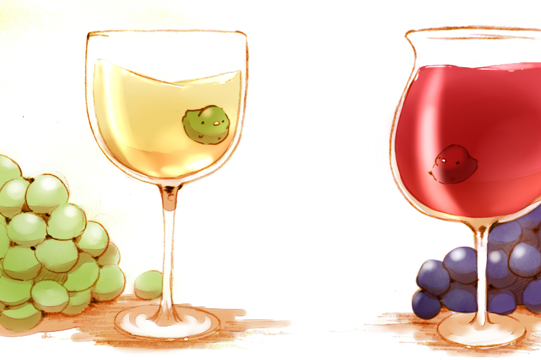

# Machine Learning Based Wine Quality Prediction Project

By Victoria Pinzhen Liao

Blog: [purrgramming.life - wine](https://purrgramming.life/machine-learning/wine/)
GitHub: [Victoria-Pinzhen-Liao/wine-quality](https://github.com/Victoria-Pinzhen-Liao/wine-quality)

In this beginner-friendly project, we will build some classic machine learning models to predict the quality of red and white wines based on physicochemical variables.
It's a classification task---a type of supervised learning in which the output are usually some sorts of labels.

**Goal**: The project gives beginners a general idea of the workflow of supervised machine learning projects.

## Dataset

To build models for the quality prediction of red and white wines, we will use the Wine Quality Dataset of the University of California, Irvine.
This dataset contains some physicochemical values of wine together with their quality. We can use this dataset to train the model and predict the quality.

###  Reference
Paulo Cortez, University of Minho, Guimarães, Portugal, http://www3.dsi.uminho.pt/pcortez
A. Cerdeira, F. Almeida, T. Matos and J. Reis, Viticulture Commission of the Vinho Verde Region(CVRVV), Porto, Portugal @2009

